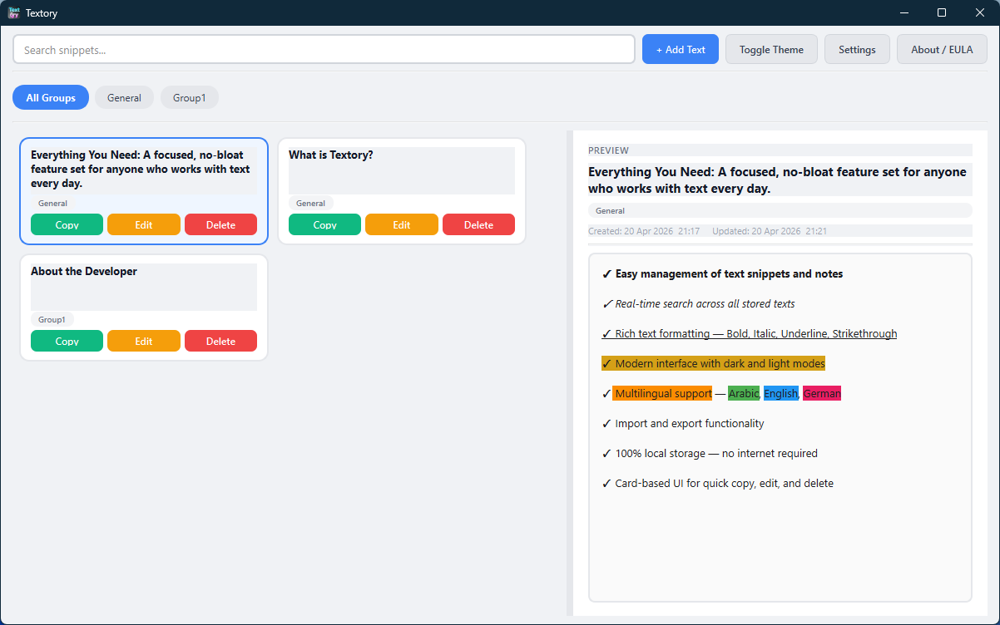
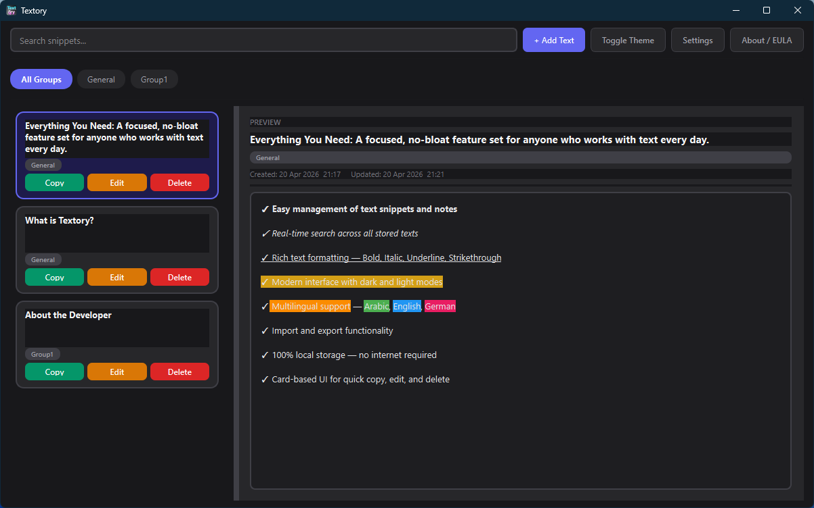
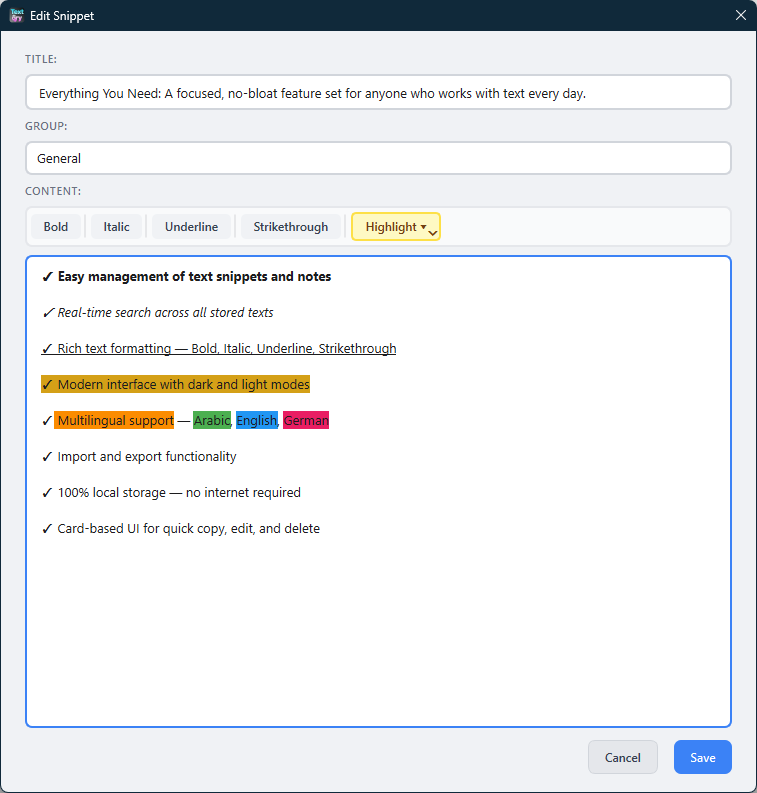
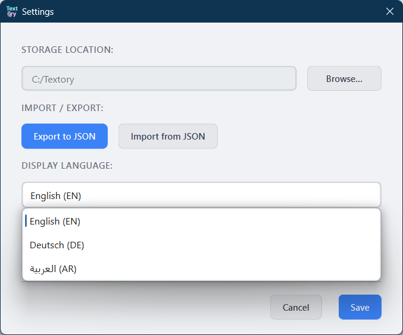

## Screenshots

### Light Mode

### Dark Mode

### Add / Edit Snippet

### Settings

---

# About Textory

---

## EN English

Textory is a lightweight desktop application designed for managing reusable text snippets, notes, and predefined responses.

It is built for users who require fast and reliable access to structured content without depending on cloud services or complex systems. All data is stored locally on the user’s device, ensuring full control, privacy, and independence.

The application supports rich text formatting, real-time search, and a clean, efficiency-focused interface. With built-in multilingual support (English, German, and Arabic), Textory adapts smoothly to different working environments.

Whether used in technical support, software development, or personal organization, Textory provides a simple and dependable way to manage frequently used text content.

---

## DE Deutsch

Textory ist eine leichtgewichtige Desktop-Anwendung zur Verwaltung von wiederverwendbaren Textbausteinen, Notizen und vordefinierten Antworten.

Die Anwendung richtet sich an Benutzer, die schnellen und zuverlässigen Zugriff auf strukturierte Inhalte benötigen, ohne auf Cloud-Dienste oder komplexe Systeme angewiesen zu sein. Alle Daten werden lokal auf dem Gerät gespeichert, was vollständige Kontrolle, Datenschutz und Unabhängigkeit gewährleistet.

Textory unterstützt Rich-Text-Formatierung, Echtzeit-Suche und eine übersichtliche, auf Effizienz ausgelegte Benutzeroberfläche. Dank der integrierten Mehrsprachigkeit (Englisch, Deutsch und Arabisch) passt sich die Anwendung problemlos an unterschiedliche Arbeitsumgebungen an.

Ob im technischen Support, in der Softwareentwicklung oder zur persönlichen Organisation – Textory bietet eine einfache und zuverlässige Möglichkeit, häufig verwendete Texte zu verwalten.

---

## AR العربية

Textory هو تطبيق مكتبي خفيف مصمم لإدارة النصوص القابلة لإعادة الاستخدام، والملاحظات، والردود الجاهزة.

تم تطويره للمستخدمين الذين يحتاجون إلى وصول سريع وموثوق إلى محتوى منظم دون الاعتماد على الخدمات السحابية أو الأنظمة المعقدة. يتم تخزين جميع البيانات محليًا على جهاز المستخدم، مما يضمن التحكم الكامل والخصوصية والاستقلالية.

يدعم التطبيق تنسيق النصوص الغنية، والبحث الفوري، وواجهة بسيطة تركز على الكفاءة. مع دعم مدمج لعدة لغات (الإنجليزية، الألمانية، العربية)، يتكيف Textory بسهولة مع بيئات العمل المختلفة.

سواء في دعم تقني، أو تطوير برمجي، أو تنظيم شخصي، يوفر Textory طريقة بسيطة وموثوقة لإدارة النصوص المستخدمة بشكل متكرر.
